# Jellify 

A beautiful, modern desktop music player for Jellyfin servers built with Electron. Jellify provides a sleek, Spotify-like interface for your self-hosted music library with rich features including playlist management, search, lyrics support, and more.

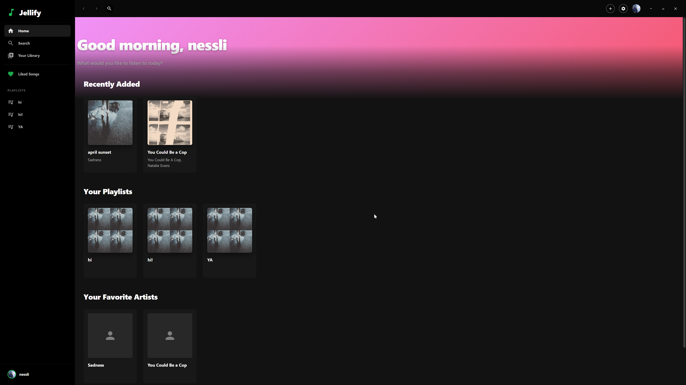

## ✨ Features

### 🎵 Core Music Features
- **Seamless Playback** - High-quality audio streaming with configurable bitrates (64-320 kbps)
- **Queue Management** - Full control over your playback queue with shuffle and repeat modes
- **Crossfade Support** - Smooth transitions between tracks (2-12 seconds)
- **Equalizer** - 10-band equalizer for fine-tuned audio control
- **Lyrics Display** - Synchronized lyrics support (LRC format) with auto-scrolling
- **Discord Rich Presence** - Show what you're listening to on your Discord profile (just like Spotify!)

### 🎨 Beautiful Interface
- **Modern UI** - Clean, Spotify-inspired design with smooth animations
- **Dark Theme** - Easy on the eyes for extended listening sessions
- **Custom Titlebar** - Frameless window with native window controls
- **Responsive Design** - Adapts beautifully to different screen sizes

### 📚 Library Management
- **Smart Organization** - Browse by albums, artists, playlists, and songs
- **Advanced Filters** - Filter by genre, sort by name, date added, or random
- **Search Everything** - Powerful search across all your music content
- **Liked Songs** - Favorite tracking with quick access

### 🔐 Account & Security
- **Secure Authentication** - Encrypted credential storage using Electron's safeStorage
- **Auto-Login** - Optional automatic login for convenience
- **Multi-User Support** - View other user profiles and their listening activity

## 📸 Screenshots

### Login Screen
Clean and simple authentication interface to connect to your Jellyfin server.

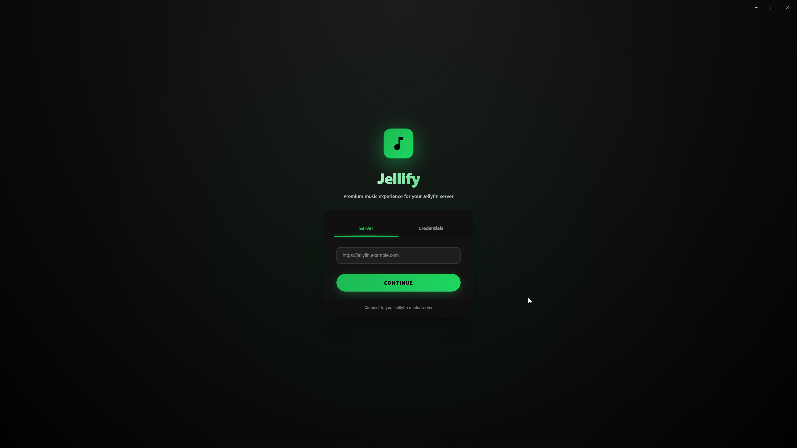

### Home
Personalized home screen with time-based greetings and your recently added music.


### Library
Browse your entire music collection with powerful filtering and sorting options.

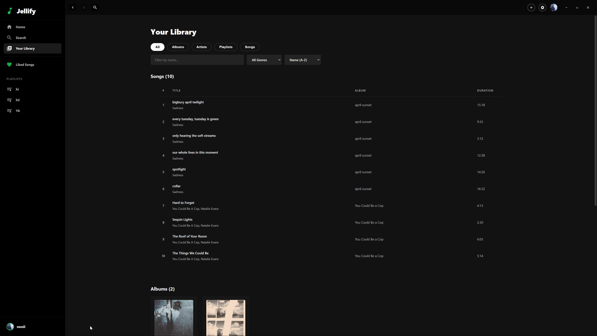

### Album View
Beautiful album detail pages with track listings and playback controls.

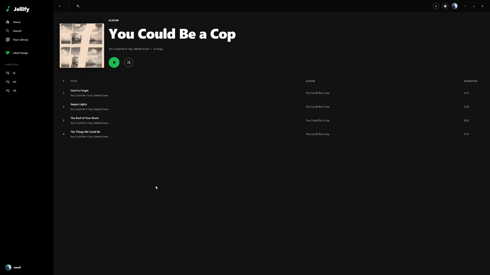

### Playlist
Create and manage playlists with ease.

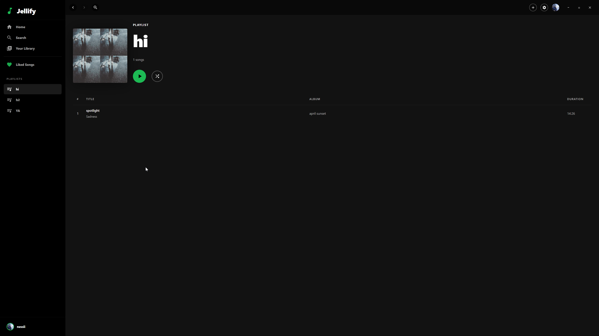

### Search
Powerful search functionality to find songs, albums, artists, playlists, and users.

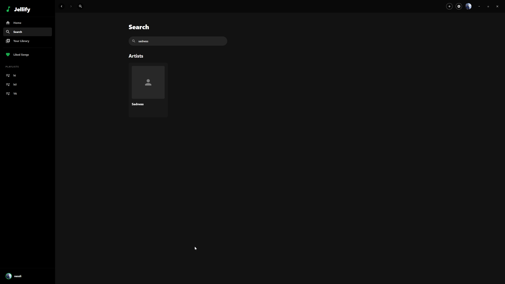

### Liked Songs
Quick access to all your favorite tracks in one place.

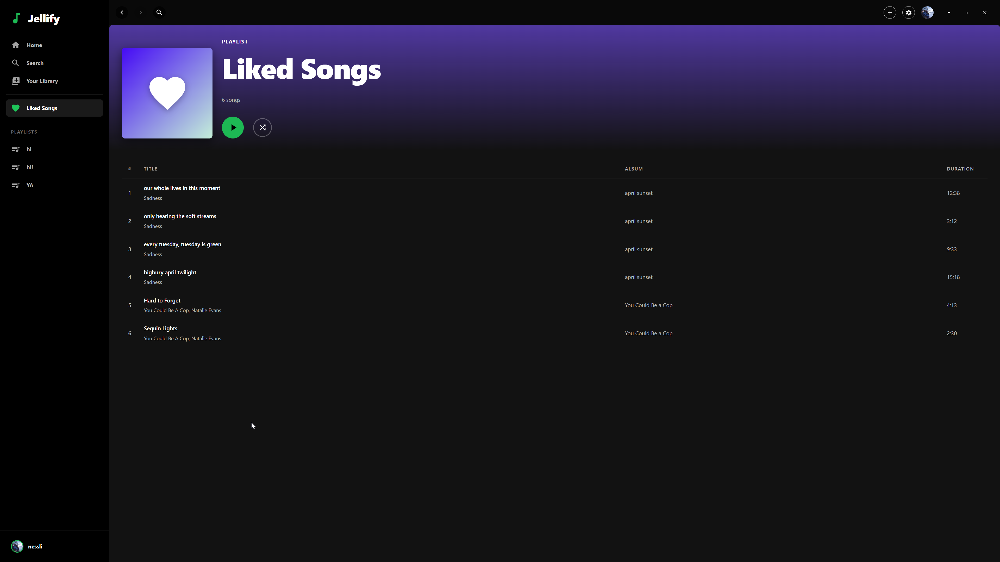

### Queue
Full visibility and control over your playback queue.

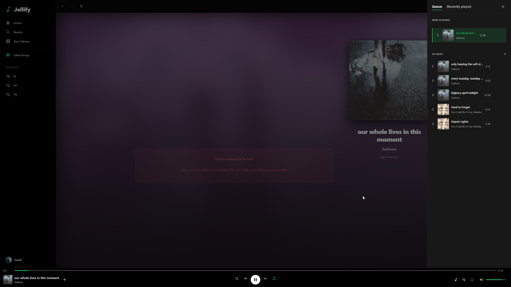

### Fullscreen Player
Immersive fullscreen mode with album art and playback controls.

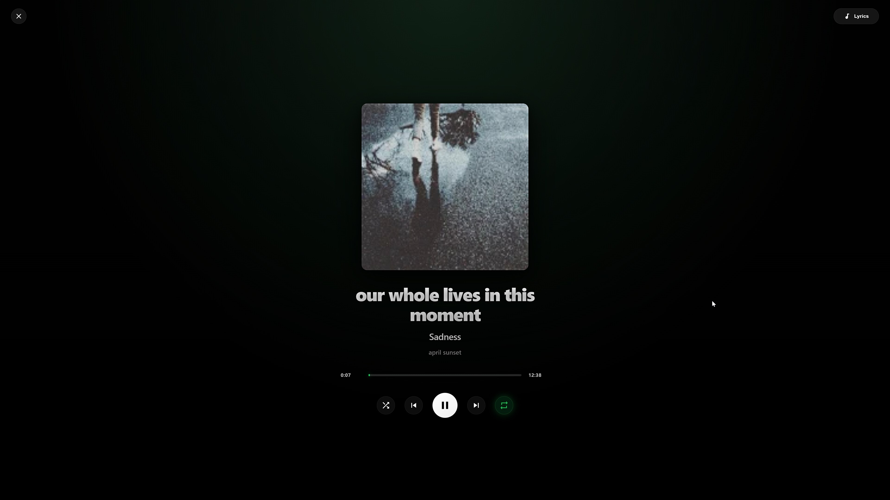

### Profile
User profiles with listening statistics and recent activity.

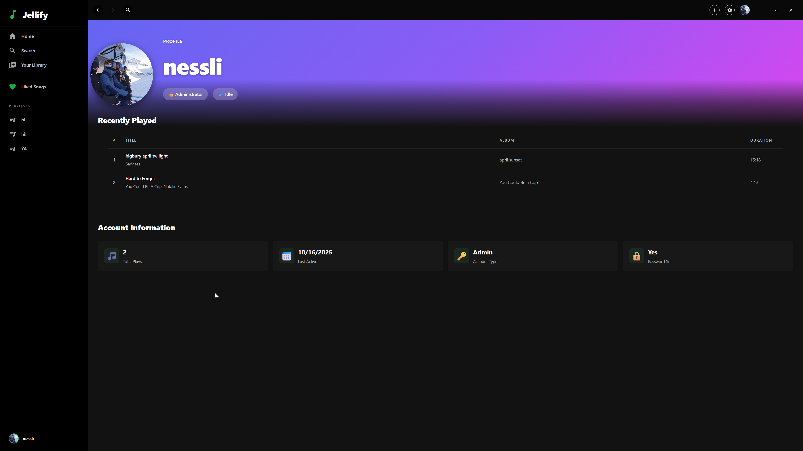

### Settings
Comprehensive settings for audio quality, playback options, equalizer, and account management.

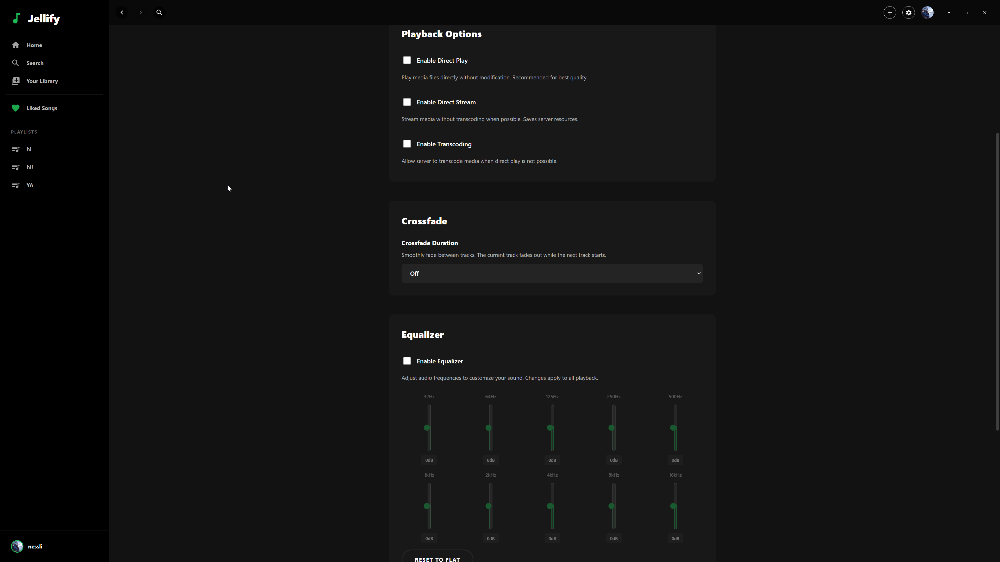

## 🚀 Getting Started

### Prerequisites
- **Node.js** (v16 or higher)
- **Jellyfin Server** (v10.8 or higher)
- A music library configured in your Jellyfin server
- **Discord** (optional, for Rich Presence integration)

### Installation

1. **Clone the repository**
   ```bash
   git clone https://github.com/nessli420/jellify.git
   cd jellify
   ```

2. **Install dependencies**
   ```bash
   npm install
   ```

3. **Run the application**
   ```bash
   npm start
   ```
#### Portable Executable (Recommended)

Create a single, standalone portable executable that can run from anywhere:

```bash
npx electron-builder --win portable
```
This will generate a portable executable: **`dist/Jellify 1.0.0.exe`**

**Benefits:**
- **Single file** - No installation required, runs from anywhere
- **No dependencies** - All files self-extract to a temporary location at runtime
- **~78 MB** - Complete app bundled in one executable
- **Custom icon** - Automatically embeds `icon.ico` from the project root

#### Development Build

For testing, create an unpacked directory build:

```bash
npm run package
```

This generates a folder-based build in `dist/Jellify-win32-x64/` with all files visible. The `Jellify.exe` in this folder **requires all supporting files** (like `icudtl.dat`, `locales/`, `resources/`) to be in the same directory.

#### Custom Icon

To use your own icon:

1. Create or convert an icon to `.ico` format (recommended sizes: 16x16 to 256x256)
2. Save it as `icon.ico` in the project root
3. Run the build command - the icon will automatically be embedded


## 🎮 Usage

1. **Connect to your Jellyfin server**
   - Launch Jellify
   - Enter your Jellyfin server URL (e.g., `http://192.168.1.100:8096`)
   - Log in with your credentials

2. **Navigate your library**
   - Use the sidebar to browse Home, Library, Search, and Playlists
   - Click on albums, artists, or playlists to view details
   - Use the top navigation buttons to go back and forward

3. **Play music**
   - Click on any track to start playback
   - Use the play button on album/playlist cards for quick playback
   - Control playback with the bottom player bar

4. **Customize your experience**
   - Access Settings from the top-right menu
   - Adjust audio quality, enable crossfade, or tune the equalizer
   - Enable/disable auto-login for convenience

## 🛠️ Technologies Used

- **Electron** - Desktop application framework
- **Jellyfin API** - Media server backend
- **Vanilla JavaScript** - No heavy frameworks, lightweight and fast
- **Native Web APIs** - Web Audio API for audio playback and effects
- **CSS3** - Modern styling with gradients, animations, and transitions

## 🔧 Configuration

### Audio Settings
Configure playback quality and behavior in Settings:
- **Streaming Quality**: 64 kbps - 320 kbps
- **Direct Play**: Play media files without modification
- **Direct Stream**: Stream without transcoding when possible
- **Transcoding**: Server-side transcoding fallback

### Equalizer Presets
The 10-band equalizer supports frequencies:
- 32Hz, 64Hz, 125Hz, 250Hz, 500Hz
- 1kHz, 2kHz, 4kHz, 8kHz, 16kHz
- Range: -12dB to +12dB per band

## 📝 Features in Detail

### Context Menus
Right-click on tracks for quick actions:
- Add to queue
- Add to playlist
- Like/Unlike
- Go to album/artist

### Keyboard Shortcuts
- `Space` - Play/Pause
- `Ctrl/Cmd + F` - Focus search (when available)
- `Ctrl/Cmd + L` - Toggle lyrics view
- `Alt + Left/Right` - Navigate back/forward

### Lyrics Support
Jellify supports synchronized lyrics in LRC format:
- Place `.lrc` files alongside your music files
- Click on lyrics lines to seek to that position
- Lyrics auto-scroll and highlight as the track plays

### Discord Rich Presence
Show off your music taste to your Discord friends:
- Displays currently playing track, artist, and album
- Shows playback progress with a time bar
- Updates automatically when you change tracks or pause
- Works just like Spotify's Discord integration
- See [DISCORD_SETUP.md](DISCORD_SETUP.md) for setup instructions

## 🤝 Contributing

Contributions are welcome! Please feel free to submit a Pull Request. For major changes, please open an issue first to discuss what you would like to change.

## 🙏 Acknowledgments

- Jellyfin team for the excellent media server
- The Electron community for the powerful framework
- All contributors and users of this project

## 🐛 Known Issues

- Lyrics may not display if the LRC file format is non-standard
- Some Jellyfin servers may require additional configuration for streaming

## 📮 Support

If you encounter any issues or have questions:
- Check the [Issues](https://github.com/nessli420/jellify/issues) page
- Create a new issue with details about your problem
- Include your Jellyfin server version and OS information

**GitHub Repository:** https://github.com/nessli420/jellify


